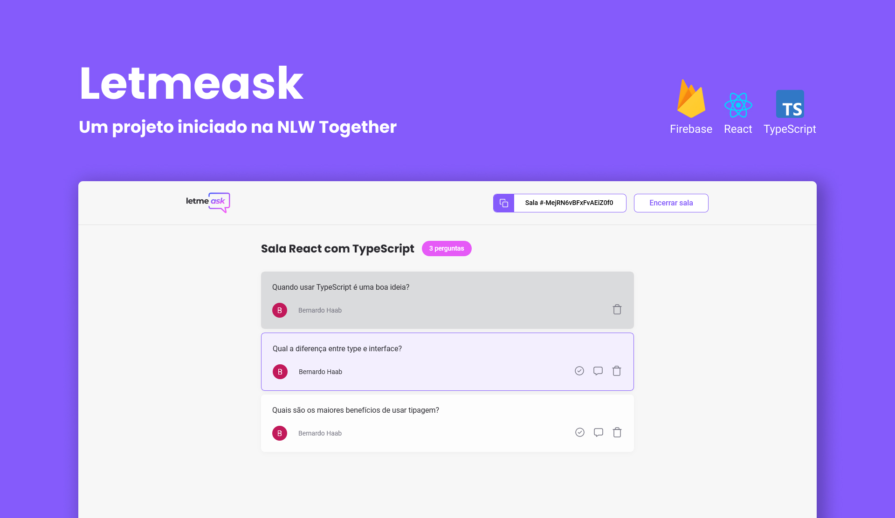

  

# 💬 Projeto

Iniciado na semana NLW Together da Rocketseat, este projeto busca auxiliar criadores de conteúdo a entender e resolver as dúvidas de sua audiência.

  * A pessoa criadora de conteúdo pode criar uma customizada e compartilhá-la;

  * O usuário pode, além de criar suas perguntas, curtir as de outras pessoas;

  * O administrador da sala possui algumas funções, como destacar uma pergunta ou marca-la como respondida.

# 👨‍💻 Tecnologias Usadas

* 

    <a style="text-decoration: none; color: white;" href="https://pt-br.reactjs.org/">
      
      &emsp;React
    </a>
  

* 

    <a style="text-decoration: none; color: white;" href="https://pt-br.reactjs.org/">
      
      &emsp;Typescript
    </a>
  

* 

    <a style="text-decoration: none; color: white;" href="https://pt-br.reactjs.org/">
      
      &emsp;Firebase
    </a>
  

---

Feito com 🖤 por Bernardo Haab

